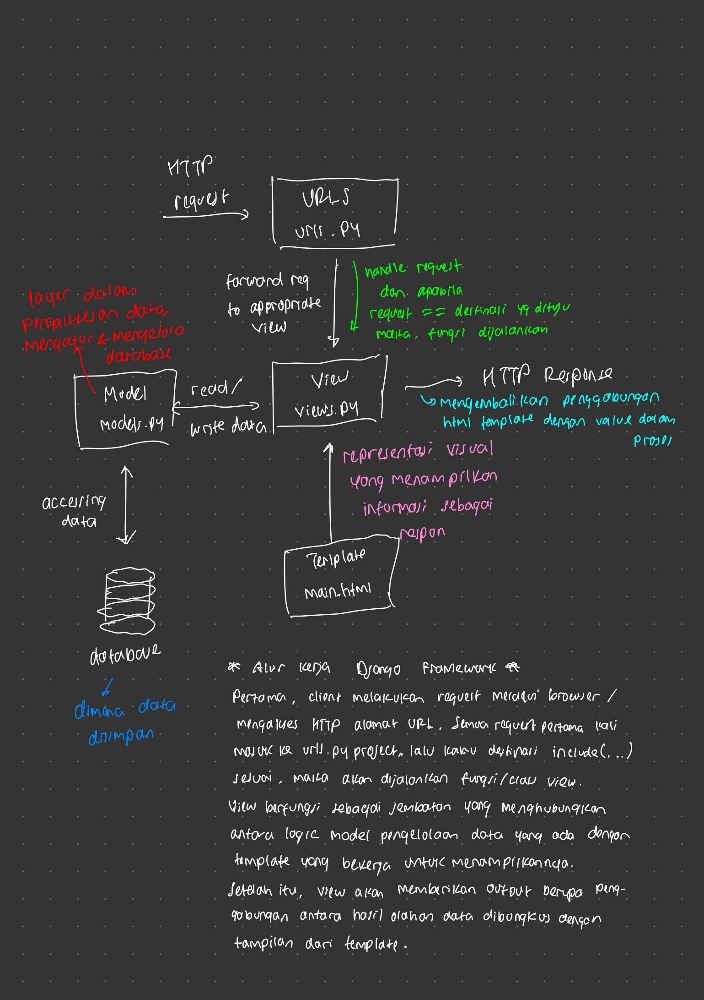

# lil-champs
Tugas 2 PBP
Chris Darren Imanuel
2406396956

https://github.com/sweetsaltt/lil-champs
https://chris-darren-lilchamps.pbp.cs.ui.ac.id/

1. Saya telah mengimplementasikan checklist di atas secara bertahap dan runut. Pertama, saya buat proyek baru dan siapkan dependencies dan requirements yang dibutuhkan. Setelah itu, saya siapkan environment serta keperluan untuk deploy yang menghubungkan dengan kredensial untuk database. Selain itu, saya juga configure untuk settings nya dan run server. Setelah berhasil run server, segera saya push dan deploy ke PWS supaya nantinya saya bisa update pengerjaan saya. Kedua, Setelah memastikan bahwa proyek saya berjalan, saya kemudian mulai untuk membuat aplikasi main dan routing ke settings proyek agar terhubung. Setelahnya saya mulai kerjakan Template yaitu cetakan yang nantinya akan menampilkan aplikasi saya melalui HTML. Selanjutnya, saya buat dan kerjakan model Product dan tambahkan atribut produk saya. Ketiga, saya handling bagian views.py dan integrasikan logic yang ada ke bagian template sebelumnya. Tak lupa, saya atur routing URL aplikasi main dan juga proyek supaya view dapat dijalankan. 

2. 

3. settings.py dalam proyek django berfungsi untuk mengatur dan menyusun bagaimana suatu proyek berjalan dan berperilaku. Berdasarkan tutorial dan pengerjaan yang dilakukan, settings.py digunakan untuk enabler environment variables, memberikan akses aplikasi web, melakukan production, hingga mengatur konfigurasi database.

4. Migrasi database dilakukan dengan melakukan makemigrations terlebih dahulu. makemigrations berfungsi untuk mengumpulkan perubahan yang terjadi pada model menjadi satu file migrasi. Setelahnya, kita lakukan migrate untuk menerapkan perubahan tersebut ke database. Dengan demikian, migrasi dilakukan untuk memperbarui dan update model pengerjaan kita agar tetap suitable dengan database.

5. Menurut saya, framework Django cocok untuk belajar sebagai beginner karena Django sendiri berjalan di atas Python. Python sendiri memiliki struktur dan sintaks layaknya seperti berbahasa inggris biasa sehingga familiar untuk dipelajari. Selain itu, Django sendiri telah didevelop dan mempunyai resource dan fasilitas yang mumpuni untuk pembelajaran.

6. Saya sendiri tidak menemukan masalah atau issue dalam pengerjaan tutorial. Mungkin sedikit pesan dari saya untuk teman-teman asdos untuk terus semangat dan mohon bimbingannya selama satu semester ini belajar PBP.

#
Tugas 3 PBP

1. Data delivery atau pengiriman data dari satu titik ke titik lain, seperti dari client - browser atau sistem ke sistem lain, sangatlah penting diimplementasikan dalam sebuah platform. Kita memerlukan data delivery untuk menjaga integrasi sistem agar berfungsi dengan baik, memastikan kita sebagai pengguna memiliki data yang relevan dan terbaru, serta membantu kita untuk upscale dan eskalasi platform agar semakin cepat dan efisien sehingga bermanfaat untuk kebutuhan kita.

2. JSON dan XML mempunyai kelebihan dan kekurangannya masing-masing. Di satu sisi, JSON lebih popular untuk kalangan umum karena sifatnya yang lightweight dan ringan, lebih mudah untuk dibaca dan dimengerti, cepat dan mudah diparsing, serta memiliki dukungan yang luas dan langsung terintegrasi dengan JavaScript sehingga pengembangannya lebih baik. Sedangkan untuk XML unggul dalam mengatasi dokumen yang lebih kompleks dan validasi yang lebih ketat.
